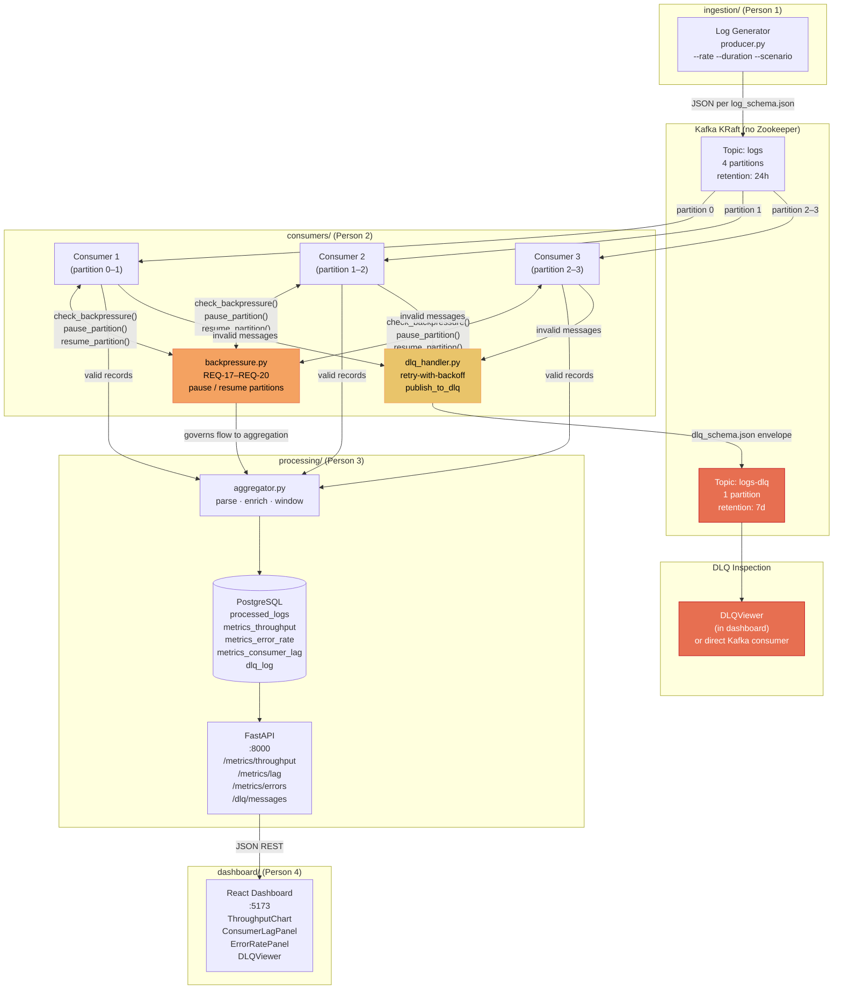

<!-- markdownlint-disable MD033 -->
# LogFlow

**A fault-tolerant, real-time log processing pipeline built on Apache Kafka.**

Four engineers work on isolated layers. One command spins up the full
infrastructure. Shared JSON schemas are the only coupling between layers.

---

## Architecture



> **Note**: `backpressure.py` governs pause/resume behaviour between the Consumer
> Group and the Aggregation stage (REQ-17–REQ-20). When internal buffer depth or
> Kafka consumer lag exceeds the HIGH_WATER threshold, affected partitions are
> paused. They resume when lag drops below the LOW_WATER threshold.

---

## ASCII Architecture (quick reference)

```
┌──────────────────────────────────────────────────────────────────────┐
│                          LogFlow Pipeline                            │
│                                                                      │
│  [Log Generator]──→[Kafka: logs (4 partitions)]──→[Consumer Group]   │
│    producer.py          KRaft, no ZK               3 × consumer.py   │
│    --scenario                                      rebalance_config  │
│                                                         │    │       │
│                              ┌──────────────────────────┘    │       │
│                              ↓                               ↓       │
│                     [backpressure.py]              [dlq_handler.py]  │
│                     pause/resume partitions        retry → DLQ       │
│                     REQ-17 to REQ-20                    │            │
│                              │                           ↓           │
│                              ↓                  [Kafka: logs-dlq]    │
│                      [aggregator.py]            1 partition          │
│                      parse·enrich·window                │            │
│                              │                          ↓            │
│                              ↓                   [DLQViewer]         │
│                        [PostgreSQL]              dashboard / CLI     │
│                    5 tables, indexed                                 │
│                              │                                       │
│                              ↓                                       │
│                    [FastAPI :8000]                                   │
│              /metrics/* + /dlq/messages                              │
│                              │                                       │
│                              ↓                                       │
│                [React Dashboard :5173]                               │
│          ThroughputChart · ConsumerLagPanel                          │
│          ErrorRatePanel  · DLQViewer                                 │
└──────────────────────────────────────────────────────────────────────┘
```

---

## Folder Ownership Map

| Folder          | Owner    | Responsibility                                    |
|-----------------|----------|---------------------------------------------------|
| `ingestion/`    | Person 1 | Log generator, Kafka producer, log templates      |
| `consumers/`    | Person 2 | Consumer group, DLQ handler, backpressure, rebalance config |
| `processing/`   | Person 3 | Aggregator, PostgreSQL schema, FastAPI endpoints  |
| `dashboard/`    | Person 4 | React UI, Recharts panels, API client             |
| `shared/schemas/` | All   | Shared JSON schemas — **DO NOT modify unilaterally** |
| `tests/`        | All      | Scenario test docs — one per test case            |

---

## Shared Interface Contracts

| Schema | Produced by | Consumed by |
|--------|-------------|-------------|
| `shared/schemas/log_schema.json` | `ingestion/producer.py` | `consumers/consumer.py` |
| `shared/schemas/dlq_schema.json` | `consumers/dlq_handler.py` | `processing/aggregator.py`, `dashboard/DLQViewer.jsx` |
| FastAPI JSON responses | `processing/api/main.py` | `dashboard/src/api/client.js` |
| PostgreSQL tables | `processing/aggregator.py` | `processing/api/main.py` |

> ⚠️ **Schema changes require team agreement.** Any modification to
> `shared/schemas/*.json` must be discussed and version-bumped before merging.

---

## Quick Start

### 1. Clone & configure

```bash
git clone <repo-url> logflow
cd logflow
cp .env.example .env
# Edit .env if needed (defaults work for local Docker setup)
```

### 2. Start infrastructure

```bash
docker compose up -d
```

This starts:
- **Kafka** (KRaft mode, port 9092)
- **kafka-init** (creates `logs` topic with 4 partitions + `logs-dlq` with 1)
- **PostgreSQL** (port 5432, schema auto-applied from `processing/db/schema.sql`)
- Placeholder containers for producer, consumer, processing, dashboard

Verify Kafka topics:
```bash
docker exec logflow-kafka kafka-topics \
  --bootstrap-server localhost:9092 --list
# Expected: logs  logs-dlq
```

Verify PostgreSQL tables:
```bash
docker exec logflow-postgres psql -U logflow_user -d logflow \
  -c "SELECT tablename FROM pg_tables WHERE schemaname='logflow';"
```

### 3. Person 1 — Ingestion

```bash
cd ingestion
pip install -r requirements.txt
python producer.py --rate 10 --duration 60 --scenario normal
```

### 4. Person 2 — Consumers

```bash
cd consumers
pip install -r requirements.txt
# Run 3 instances in separate terminals:
python consumer.py   # × 3
```

### 5. Person 3 — Processing + API

```bash
cd processing
pip install -r requirements.txt
python aggregator.py          # background aggregation loop
python -m uvicorn api.main:app --reload --port 8000
```

Test endpoints:
```bash
curl http://localhost:8000/health
curl http://localhost:8000/metrics/throughput?minutes=10
curl http://localhost:8000/dlq/messages?limit=20
```

### 6. Person 4 — Dashboard

```bash
cd dashboard
npm install
npm run dev
# Open http://localhost:5173
```

---

## Environment Variables

All variables are defined in [.env.example](.env.example).
Copy to `.env` before running any service. Key variables:

| Variable | Default | Used by |
|----------|---------|---------|
| `KAFKA_BROKER` | `localhost:9092` | producer.py, consumer.py |
| `KAFKA_TOPIC_LOGS` | `logs` | producer.py, consumer.py |
| `KAFKA_TOPIC_DLQ` | `logs-dlq` | dlq_handler.py |
| `KAFKA_CONSUMER_GROUP` | `logflow-group` | consumer.py, rebalance_config.py |
| `DATABASE_URL` | `postgresql://...@localhost:5432/logflow` | connection.py |
| `FASTAPI_PORT` | `8000` | api/main.py |
| `VITE_API_BASE_URL` | `http://localhost:8000` | dashboard/src/api/client.js |

---

## Test Scenarios

| Scenario | File | Owner |
|----------|------|-------|
| Normal steady-state | [`tests/scenario_normal_load.md`](tests/scenario_normal_load.md) | P1 + P2 |
| Traffic spike + backpressure | [`tests/scenario_traffic_spike.md`](tests/scenario_traffic_spike.md) | P1 + P2 |
| Malformed messages → DLQ | [`tests/scenario_malformed_logs.md`](tests/scenario_malformed_logs.md) | P1 + P2 |
| Slow consumer + backpressure | [`tests/scenario_slow_consumer.md`](tests/scenario_slow_consumer.md) | P2 + P3 |
| Worker crash + rebalance | [`tests/scenario_worker_failure.md`](tests/scenario_worker_failure.md) | P2 + P3 |

---

## Branching Strategy

Each person branches from `main`:
```
main
├── feature/ingestion-producer     (Person 1)
├── feature/consumer-group         (Person 2)
├── feature/processing-api         (Person 3)
└── feature/dashboard-ui           (Person 4)
```

The only files all four branches touch are:
- `shared/schemas/` — coordinate changes via PR + team review
- `docker-compose.yml` — coordinate service name changes

All other folders are strictly owned by one person.
